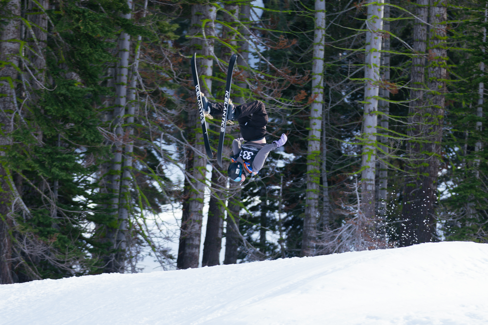

# Benjamin Scheerger Profile

## Introduction
Hi, my name is Benjamin Scheerger, and I am a Cognitive Science Major Specializing in Machine Learning, with a Computer Science Minor. I'm passionate about neuroscience, ML, and computer science. Outside of school, I love the outdoors, especially skiing, and compete for the UCSD Ski and Snowboard Team (Picture Below). 



### Technical Interests / Unordered List
* Artificial Intelligence
* NeuroScience
* Reinforcent Learning / Robotics

## My Favorite Quote
> “The secret of happiness, you see, is not found in seeking more, but in developing the capacity to enjoy less.” - Socrates

## Code Snippet
```
x = "Hello World"
print(x)
```

## Outside Web Link
[Github Profile](https://github.com/benscheerger)

## Section Link
[Link to my favorite quote](#my-favorite-quote)

## Relative Link
[Read me file](README.md)

## Ordered List (Favorite Sitcoms)

1. Parks and Recreation
2. The Office
3. Brooklyn 99

## Task List
- [x] Go to class
- [x] Do Homework
- [ ] Sleep 


